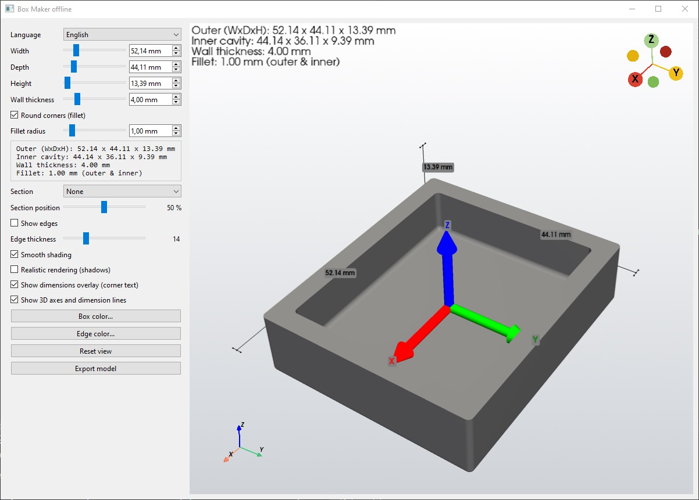
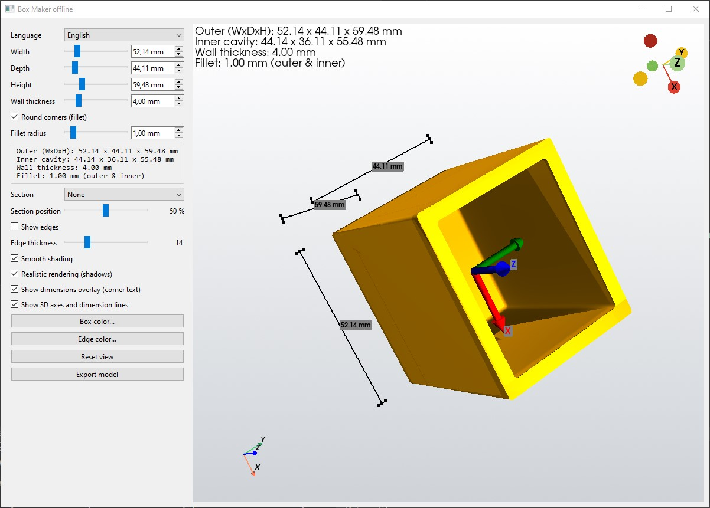

# Box Maker

A small, offline, parametric box generator with a live 3D preview — built
for 3D printing hobbyists who want quick, precise, customizable boxes
without dragging a full CAD suite into the workflow.

> **Status: early / actively evolving.** The tool currently generates
> **prismatic (rectangular) boxes only**. See [Roadmap](#roadmap) for
> what's planned next.




---

## Features

- **Live parametric preview** — width, depth, height and wall thickness
  update the 3D model in real time via sliders + precise numeric spin
  boxes (0.01 mm resolution).
- **Hollow boxes with an internal cavity**, automatically computed from
  the wall thickness.
- **Corner rounding (fillet)** on the 4 outer and 4 inner corners
  (vertical edges + floor-wall edges) — the points that take the impact
  when a box is dropped — with an automatically clamped, geometrically
  safe radius.
- **Cut-away preview** on any axis (X/Y/Z) to inspect the internal
  cavity without affecting the exported model.
- **Realistic rendering mode** with ray-traced shadows (optional —
  falls back gracefully if the GPU/driver combination doesn't support
  it).
- **On-screen dimension overlay** and **3D axis/dimension annotations**
  (technical-drawing style, with tick marks and numeric labels).
- **STL and STEP export**:
  - **STL** — a triangulated mesh, ready to slice and print as-is.
  - **STEP** — a true B-Rep (boundary representation) export via
    [build123d](https://github.com/gumyr/build123d)/OpenCascade, which
    opens as fully editable, native geometry in any CAD program
    (FreeCAD, Fusion 360, SolidWorks, etc.). Use this if you plan to
    add holes, bosses, grooves, mounting points, or any other feature
    after generating the base box.
- **Multi-language UI**: English, Italian, Spanish, French — switchable
  at runtime, no restart required.
- **Session persistence** — window position and all control values are
  restored on the next launch.

## Why STEP matters for further editing

STL only stores a triangle mesh with no real surfaces or topology — a
CAD program can only reverse-engineer it back into editable geometry,
usually with visible loss of precision (especially around fillets).
STEP preserves exact analytic surfaces, edges and vertices, so a
downstream CAD program can select a face and directly sketch, extrude,
cut, or drill on it — exactly as if the model had been built natively
in that program. Export to STEP whenever you plan to keep modifying the
box (holes for cables, snap-fit bosses, ventilation slots, labels,
mounting bosses, etc.).

## Requirements

- Windows 10 (the primary supported/tested platform for this project)
- Python 3.11+ (if running from source)

## Installation (from source)

```bash
git clone https://github.com/<your-username>/box-maker.git
cd box-maker
pip install -r requirements.txt
python main.py
```

## Usage

Run `python main.py` (or the standalone `BoxMaker.exe`, see below).
Adjust the sliders/spin boxes on the left panel; the 3D preview on the
right updates live. Use **Export** to save the current model as STL or
STEP — pick the format from the file type dropdown in the save dialog.

## Building the standalone Windows executable

The app is packaged into a single-file Windows executable with
[Nuitka](https://nuitka.net/). A ready-to-use build script is provided
in [`build.bat`](build.bat) — see that file for the exact command and
for two known gotchas (a missing build123d font file, and a missing
`lib3mf.dll`) that Nuitka's dependency scanner doesn't pick up
automatically, along with their fixes.

```bat
build.bat
```

The resulting `BoxMaker.exe` is fully self-contained (no Python
installation required on the target machine).

A GitHub Actions workflow ([`.github/workflows/build-windows.yml`](.github/workflows/build-windows.yml))
builds this executable automatically on every push to a version tag
(e.g. `v0.2.0`) and attaches it to a GitHub Release.

## Project structure

```
main.py                    entry point, splash screen, staged imports
main_window.py              main window: wires UI, geometry, rendering, export, i18n, session
geometry.py                 parametric box geometry (build123d) — no Qt/PyVista dependency
mesh_utils.py                build123d shape -> PyVista mesh conversion
rendering.py                 3D viewport: lights, shadows, mesh style
dimension_annotations.py     3D axes, dimension lines and orientation widget
exporting.py                 STL / STEP export
widgets.py                   reusable Qt widgets (labeled slider, precision slider)
i18n.py                      localization engine (flat JSON files, easy to translate)
session.py                   QSettings-based session persistence (window state, values, language)
locales/*.json                UI translations (en, it, es, fr)
box_maker.py                 legacy standalone prototype (superseded by main.py + main_window.py)
gpu_check.py                  standalone GPU/OpenGL diagnostic script
```

## Roadmap

This project is a work in progress. Planned next steps, roughly in
order:

- [ ] **Cylindrical boxes** (round tubes/cans with a lid)
- [ ] **Octagonal / N-gon prismatic boxes**
- [ ] **Freeform boxes from a 2D profile**: generate a box by extruding
      an arbitrary closed spline/vector shape (imported from SVG or
      drawn as a profile) instead of a fixed rectangle/circle/polygon —
      e.g. a case shaped like a violin body.
- [ ] Lid/cover generation matching the chosen cavity shape
- [ ] Optional snap-fit or magnet-mount features
- [ ] Linux/macOS packaging (currently Windows-only; the code itself is
      cross-platform via Qt/PySide6, but packaging/testing has only
      been done on Windows so far)

Contributions and suggestions are welcome — see
[CONTRIBUTING.md](CONTRIBUTING.md).

## Built with

- [build123d](https://github.com/gumyr/build123d) — parametric solid
  modeling on top of OpenCascade (OCCT)
- [PySide6](https://doc.qt.io/qtforpython/) — Qt for Python (GUI)
- [PyVista](https://pyvista.org/) / [pyvistaqt](https://github.com/pyvista/pyvistaqt) — 3D rendering (VTK)
- [Nuitka](https://nuitka.net/) — standalone executable packaging

## License

This project is licensed under the **GNU General Public License v3.0**
— see [LICENSE](LICENSE) for the full text.

## Changelog

See [CHANGELOG.md](CHANGELOG.md).
